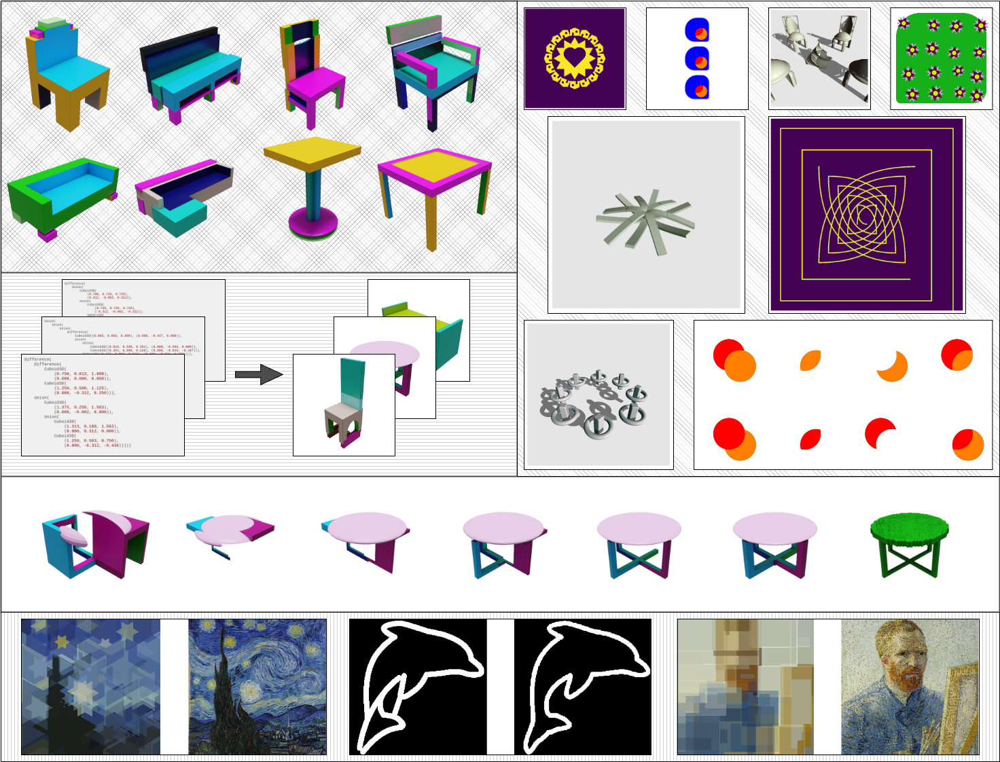
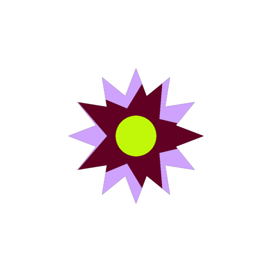
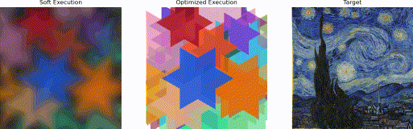

# GeoLIPI: A DSL for Implicit Geometric Modelling




GeoLIPI is a Language for modelling 2D/3D geometric objects. This is to be treated as a meta-language, from which visual programming languages can be derived. Some of the languages/visual programs that can be executed in this framework are:

1. CSG 3D Variants
2. GeoCode
3. SVG 2D

and many more. Check out `languages.md` for more details. The banner image shows ome of the highlights:

1. (top-left) Execute and render 3D Geometric expressions in Blender.
2. (top-right) Different 2D and 3D types of data that can be generated with GeoLIPI.
3. (mid-left) Batched Execution of expressions - speedy data generation.
4. (lower) Parameter Optimization for a 3D target shape.
5. (bottom) Parameter Optimization for 2D shapes.

This repository acts as the backbone for some other DSLs: SplitWeave, CISL

## Important: Research Code - Use at your own risk

I have added some documentation (with the help of ChatGPT) [here](https://bardofcodes.github.io/geolipi/index.html).

## Main usecase

Mainly, GeoLIPI attempts to embed a generic visual language in python, making it easier to use and extend for research. Additionally, it provides the following benefits:

1) Fast Batched Execution of programs - useful for training neural networks on large batches of program executions. See a demonstration of this in `notebooks/compiled_execution.ipynb`.
2) Single "symbolic" object, multiple execution strategies. This helps with "executing" the program in different platforms/systems (such as blender for rendering, and pytorch for optimization). See `scripts/blender_render_example.py`.
3) Parameter Optimization of arbitrary visual programs (All operations allow differentiable optimization of its parameters). See `notebooks/parameter_optimization.ipynb`.
4) [TBD] Help with searching programs for a desired execution (refer to our recent [paper](https://bardofcodes.github.io/coref/)).
5) Batched PyTorch execution code for all the shader toy 2D and 3D primitives described by Inigo Quilez. See `notebooks/torch_sdf2d_example.ipynb` and `notebooks/torch_sdf3d_example.ipynb`.

## Installation

Currently, there is no use actually "installing" the package. Just clone the repo and add it to your PYTHONPATH.

```bash
git clone git@github.com:BardOfCodes/geolipi.git
# Add path to your PYTHONPATH
export PYTHONPATH=$PYTHONPATH:/path/to/geolipi
```

## Examples

Here is a basic example of using the language to create an SVG image.

```python

import matplotlib.pyplot as plt
# geolipi.symbolic contains the "language" itself - disentangled from its evaluation/execution.
import geolipi.symbolic as gls
from geolipi.torch_compute import recursive_evaluate, Sketcher


# sketcher is used for creating position grids
resolution = 1024
sketcher_2d = Sketcher(device="cuda", resolution=resolution, n_dims=2)
device = "cuda"

# Create a complex SVG shape
# Each star is s Star with a star5 on a reg star
star_expression = gls.ApplyColor2D(
    gls.Star2D((0.7,),(0.25,)), sp.Symbol("burgundy"))
star_reg_expression = gls.ApplyColor2D(
    gls.RegularStar2D((0.5,), (12.,), (5.,)), sp.Symbol("lilac"))
circle_expr = gls.ApplyColor2D(
    gls.Circle2D((0.15,)), sp.Symbol("chartreuse"))
mix_expr = gls.SourceOver(circle_expr, 
    gls.SourceAtop(star_expression, star_reg_expression))


# Convert to pytorch tensors for evaluation
# mix_expr.tensor()

output = recursive_evaluate(mix_expr.tensor(), sketcher_2d)

image = output.reshape(res, res, 4).detach().cpu().numpy()

# Show image.
plt.figure(figsize=(10, 10))
plt.imshow(image)
plt.axis('off')
```

This results in this output.



Here is an example of optimizing such expressions. Check out other examples in `notebooks/`.



## Remaining TODOs

1) 3D data DiffOpt with primitive soup.

## High level issues

1) Execution time. Something like a BVH is a must for *really* complex programs.

2) Initialization time - Sympy Functions are not the simplest to initialize. Furthermore, the lookup_table for tensors is not the most efficient.

3) What to do about numerical precision? Also SDFs are almost often not exact (after boolean operations or scaling etc.)

4) Aliasing - If we want beautiful output images, we need to do something about aliasing. This is supported in the SplitWeave repository.

5) Which symbols should have 2D/3D explicit and which ones not? The code can be made more uniform in general.

## Other related works

Many other awesome libraries exist which help with pythonic 3D modelling. I have taken inspiration from many of them. Some of them are:

1) [Geometry script](https://github.com/carson-katri/geometry-script).

2) [openPySCAD](https://github.com/taxpon/openpyscad).

3) [sdf-torch](https://github.com/unixpickle/sdf-torch).

## Acknowledgements

1) A big shoutout to Inigo Quilez for his awesome [work](https://www.iquilezles.org/www/index.htm) on SDFs and shader toy.
2) Thanks to Carson Katri for his [geometry script](https://github.com/carson-katri/geometry-script) work which helped with the blender side of things.
3) [Derek](https://www.dgp.toronto.edu/~hsuehtil/)'s Blender toolbox ([link](https://github.com/HTDerekLiu/BlenderToolbox)) was quite helpful for materials.
4) Patrick-Kidger's [sympytorch](https://github.com/patrick-kidger/sympytorch) helped thinking about how to integrate sympy here.
5) Thanks to [Tim Nelson](https://cs.brown.edu/~tbn/)'s Logic for Systems course made the DNF/CNF stuff much easier to understand.
6) Thanks to my PhD Advisor [Daniel Ritchie](https://dritchie.github.io/) for his support and guidance.
7) Thanks to my lab mates [Arman Maesumi](https://armanmaesumi.github.io/) and [R. Kenny Jones](https://rkjones4.github.io/) for their feedback.
8) [Hiroki Sakuma](https://hirokisakuma.com/)'s [Torch-Sphere-Tracer](https://github.com/skmhrk1209/Torch-Sphere-Tracer) helped write my tiny dirty sphere tracer.

## Naming

GeoLIPI stands for Geometry-Lipi. Lipi is a Hindi Language term which stands for "script" (So, Geometry-Script basically). Also, the abbreviation `gls` for `geolipi.symbolic` (which contains all the sympy expressions etc.) is inspired by OpenGL Shading Language's abbreviation `glsl`.